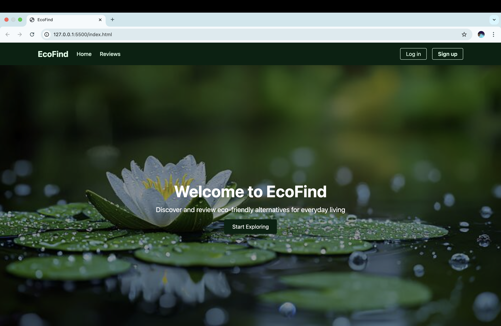
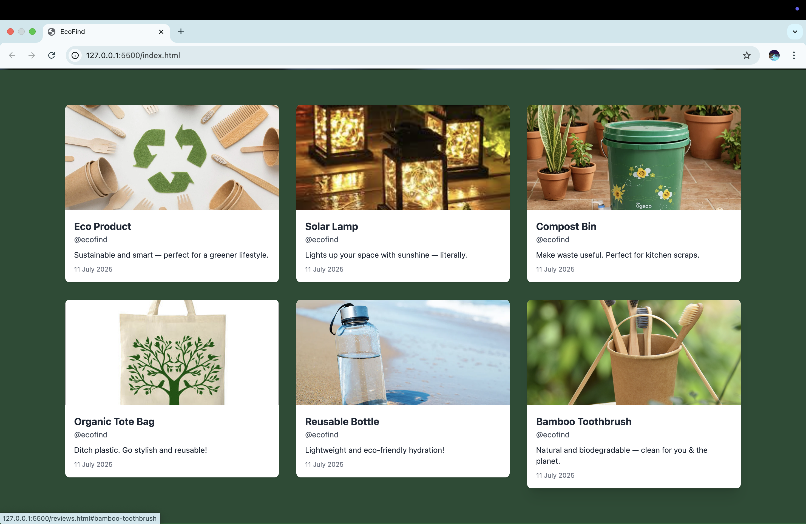
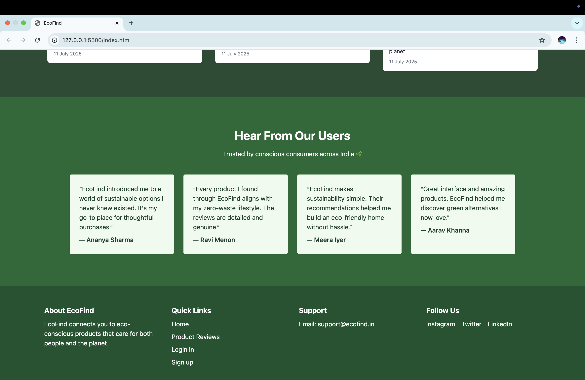
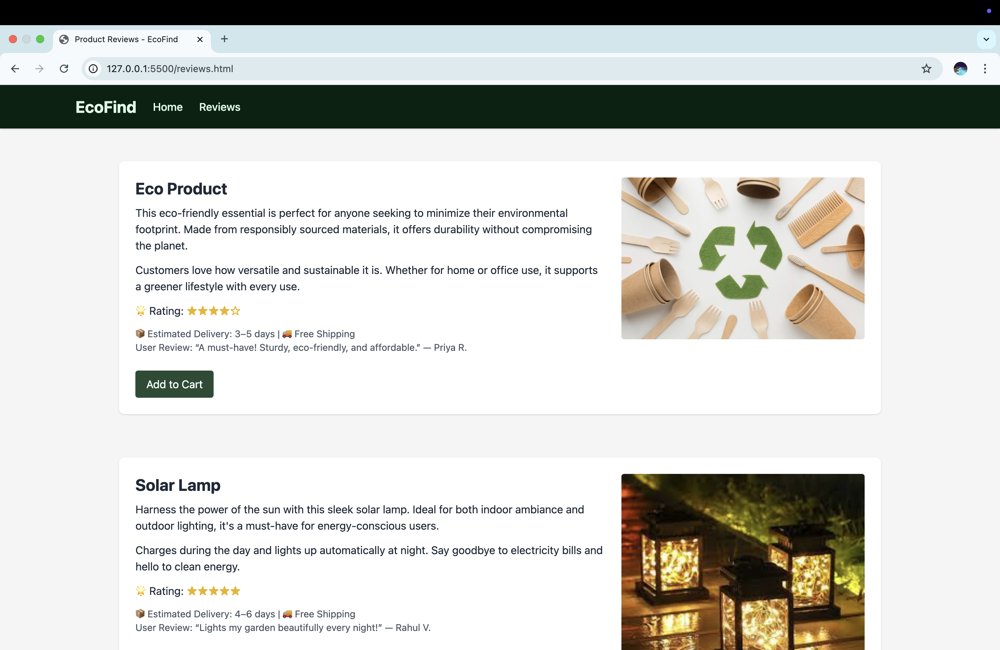
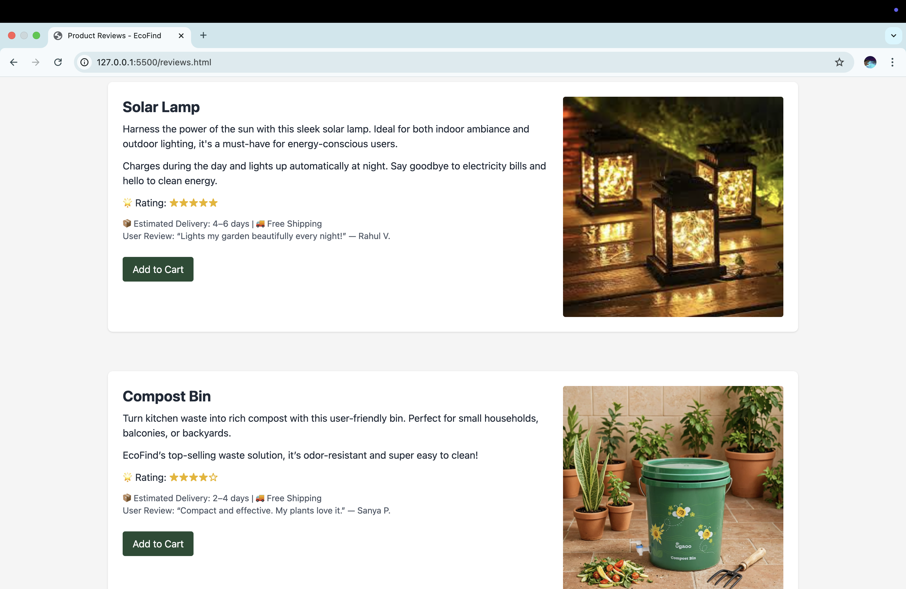
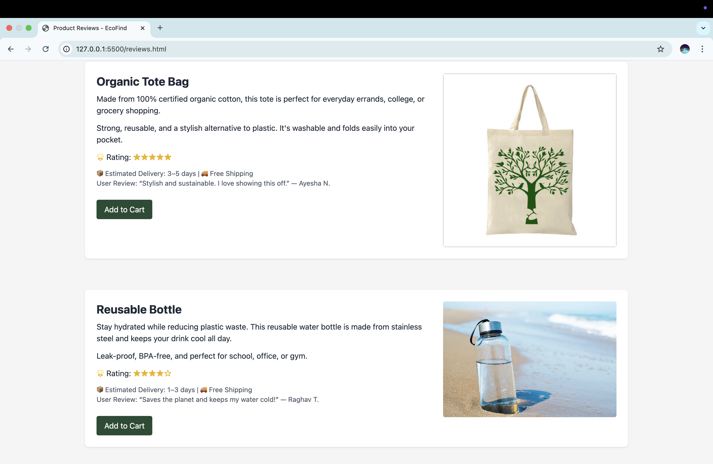
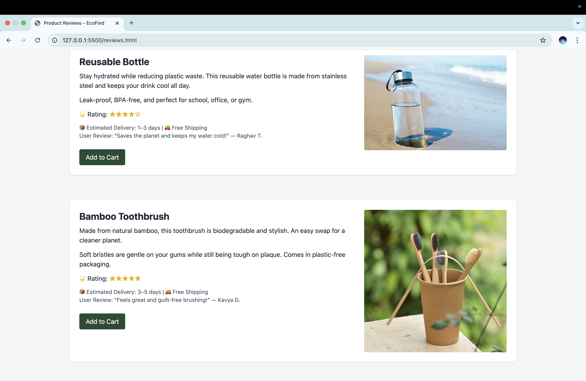
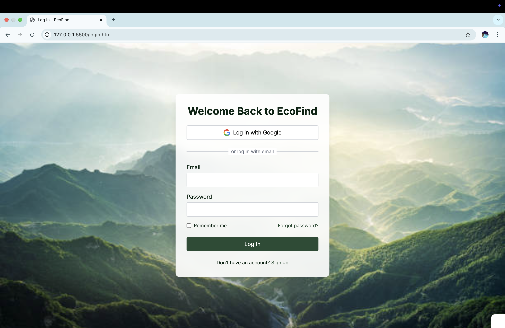

# EcoFind

**EcoFind** is a responsive and modern eco-friendly product recommendation website built using HTML, CSS, and Tailwind CSS (via CDN). It showcases sustainable products across categories like gadgets, household items, and clothing, helping users make environmentally conscious choices.

## Features

- Product discovery across multiple categories
- Individual product review pages
- User testimonials section
- Login and signup pages with clean layouts
- Fully responsive design for all devices
- Built using Tailwind CSS for fast and modern styling

## Pages Included

- `index.html` – Homepage with product highlights and navigation
- `reviews.html` – Review section with product descriptions
- `login.html` – Login page with basic authentication UI
- `signup.html` – Sign-up form with Google login placeholder and "Remember Me" option

## Technologies Used

- HTML5
- CSS3
- Tailwind CSS (via CDN)

##  Project Goals
EcoFind aims to support sustainable living by making it easier for users to discover and learn about eco-friendly products. The site is designed with a focus on simplicity, clarity, and responsiveness.
## Screenshots

### Homepage





### Reviews Page






### Login Page



### Signup Page


## Getting Started

To run the project locally:

```bash
git clone https://github.com/Ishika1106/Ecofind.git
cd Ecofind
Then open index.html in your browser.
##  Project Goals
EcoFind aims to support sustainable living by making it easier for users to discover and learn about eco-friendly products. The site is designed with a focus on simplicity, clarity, and responsiveness.

